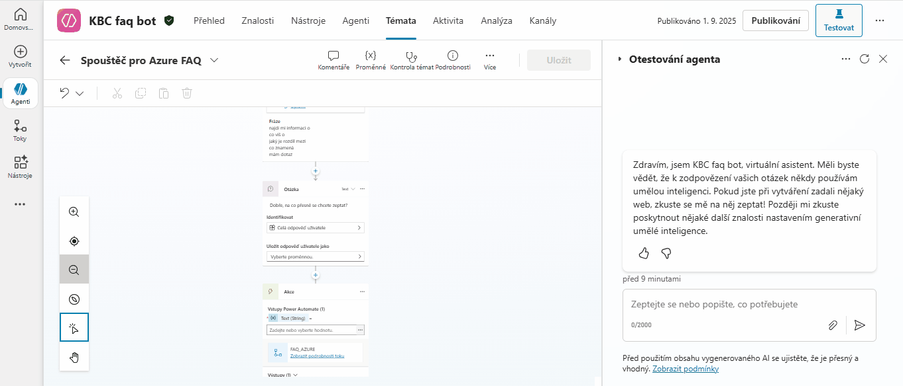

# KBC FAQ Bot - Connecting Copilot Studio and Azure Functions

This project demonstrates the complete integration of a conversational agent built in **Microsoft Copilot Studio** with custom backend logic hosted in an **Azure Function** (Python). Communication is orchestrated by **Power Automate** and standardized via a **Custom Connector**.

---
## Architecture and Conversation Flow

The entire solution is built on four key components that communicate with each other to guide the user through the entire query and response process.

### Architecture
The data flow proceeds in the following order:
```
User
   |
   v
[1. Copilot Studio Topic] ---------------------> (Triggers a flow with the user's query)
   |
   v
[2. Power Automate Flow] ----------------------> (Calls an action in the connector)
   |
   v
[3. Custom Connector] -------------------------> (Calls the Azure Function API)
   |
   v
[4. Azure Function (Python)] -----------------> (Processes the query and returns JSON)
   |
   `----<----<----<----<----<----<----<----<---- (The response returns via the same path)
```

### Example Conversation with Explanation

Here is a demonstration of how this architecture works in practice and what each step means:

**You:** `mám dotaz`
> **Explanation:** The user utilizes a trigger phrase. This signals to the bot that they want to activate the special capability of searching an external database, rather than conducting a general conversation.

**Bot:** `Dobře, na co přesně se chcete zeptat?`
> **Explanation:** The Copilot has triggered the correct Topic. It is now asking a clarifying question to obtain the specific query, which it will then send for processing.

**You:** `Jaké jsou poplatky za vedení účtu?`
> **Explanation:** The user provides the final query. This value is saved to a variable and securely passed through Power Automate and the connector to the Azure Function.

**Bot:** `Testovací odpověď z Azure Function pro dotaz: 'Jaké jsou poplatky za vedení účtu?'`
> **Explanation:** This is the final response that the bot received directly from our internal system (the Azure Function). It proves that the entire connection chain works successfully from start to finish.

1.  **Copilot Studio (Frontend):** Manages the conversation with the user, recognizes intent (using phrases or a description), and calls the Power Automate flow.
2.  **Power Automate (Orchestrator):** Serves as the "glue." It receives data from the Copilot, calls the connector, processes the response (using the key **Parse JSON** step), and returns the result.
3.  **Custom Connector (Adapter):** A standardized "wrapper" around the Azure Function, allowing the Power Platform to easily communicate with the API using an OpenAPI specification.
4.  **Azure Function (Backend):** The "brain" of the operation. This project includes two functions:
    * `faq`: The main function that receives a query and returns an answer.
    * `swagger_get`: A helper function that serves the manually created `swagger.json` file.

---
## Technology Stack
* Microsoft Copilot Studio
* Microsoft Power Automate
* Microsoft Power Platform (for Custom Connectors)
* Microsoft Azure Functions (Python 3.9+)
* OpenAPI (Swagger)

---
## Project Structure
```
/
|-- faq/
|   |-- __init__.py      # Main logic for responses
|   `-- function.json
|-- swagger_get/
|   |-- __init__.py      # Function for serving swagger.json
|   `-- function.json
|-- .gitignore
|-- host.json
|-- requirements.txt     # Python dependencies (just azure-functions)
`-- swagger.json         # Manually created OpenAPI specification
```

---
## Setup and Configuration

1.  **Azure Function:**
    * Deploy both functions (`faq` and `swagger_get`) to a single Function App in Azure.
    * Obtain the URL of the `swagger_get` function and its **Function Key** for authentication.
2.  **Custom Connector:**
    * In `make.powerapps.com`, create a new Custom Connector.
    * Import the OpenAPI from the `swagger.json` file or from the URL of the `swagger_get` function.
    * In the "Security" section, set the authentication type to **API Key**. Set the parameter name to `x-functions-key` and the location to `Header`.
3.  **Power Automate Flow:**
    * Create a flow triggered from Copilot Studio (Power Virtual Agents).
    * Add an action that calls your new Custom Connector.
    * Add the key step **"Parse JSON"** to process the `Body` of the response from the connector. Generate the schema from a sample: `{ "answer": "test" }`.
    * Add the final step **"Return value(s) to Power Virtual Agents"** and insert the `Body answer` from the "Parse JSON" step into the `answer` output variable.
4.  **Copilot Studio Topic:**
    * Create a new Topic.
    * Set up the trigger (either using **phrases** or a **description** for Generative AI).
    * Add a "Question" node to get the query from the user.
    * Add a "Call an action" node and select your created Power Automate flow. Connect the input and output variables.
    * Add a "Send a message" node to display the final answer.

---
## Key Learnings
* **Third-Party Dependency Issues:** The automatic generation of an OpenAPI specification using the `azure-functions-openapi` library proved to be unreliable due to incompatibilities with the modern Azure environment. Manually creating the `swagger.json` file is a more robust alternative.
* **Explicit Parsing in Power Automate:** To reliably pass data from the connector back to the Copilot, it is absolutely essential to use the **"Parse JSON"** action. Without it, the flow may succeed, but the data will not be passed to the Copilot in the correct format.
* **Copilot Studio UI Evolution:** The interface is changing rapidly. It is important to understand the difference between the classic **phrase-based** trigger and the new generative **description-based** approach for topics.

---
## 🚀 GIF LIVE DEMO BOT

